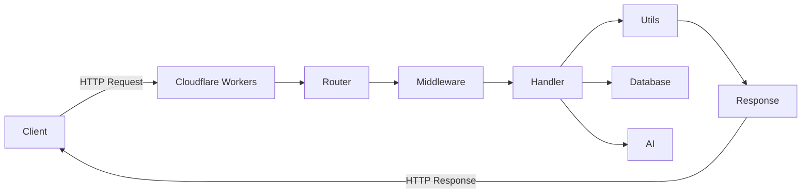
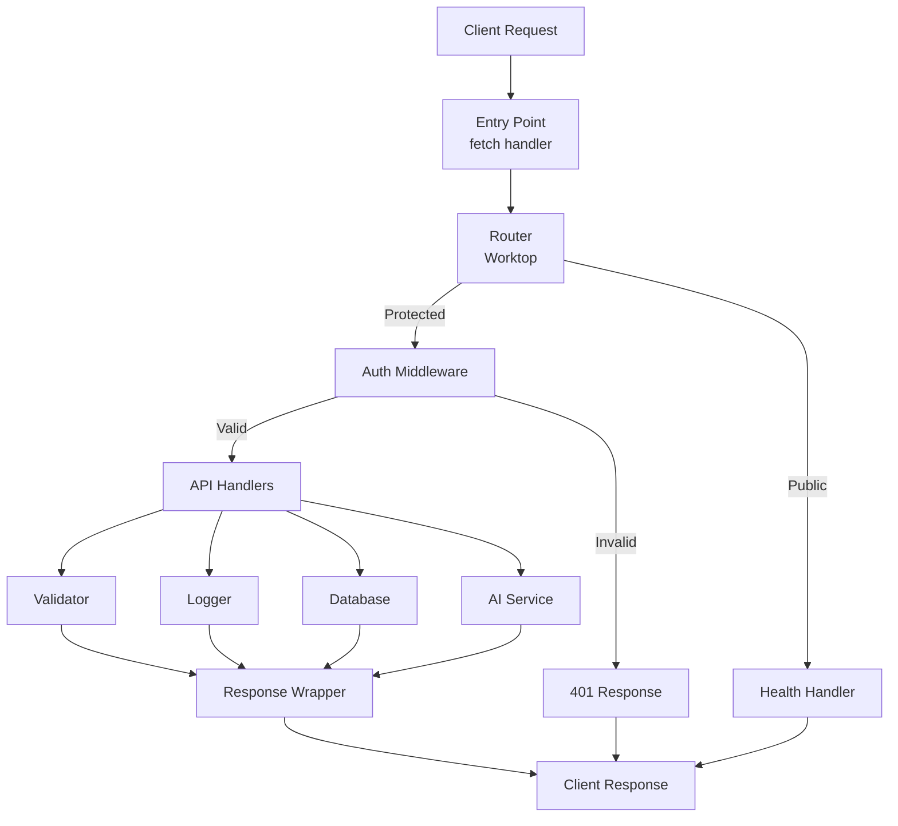
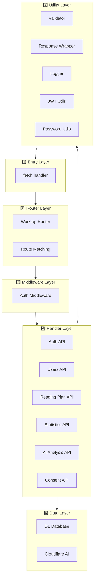
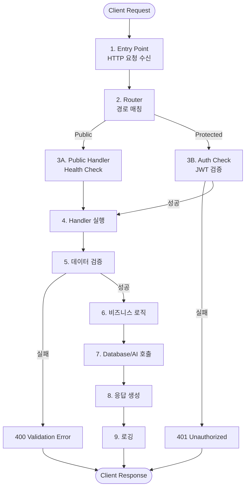
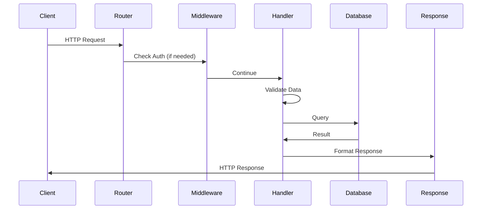
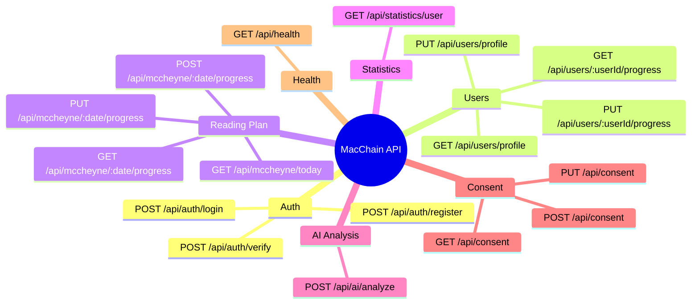
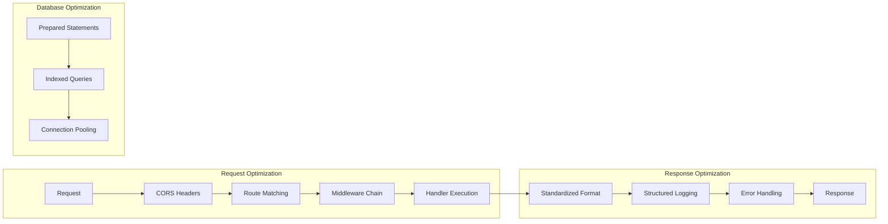

# MacChain API 아키텍처 시각화

## 📐 전체 아키텍처

### 간단한 구조도



### 상세 레이어 구조



### 레이어별 구성 요소



## 🔄 요청 처리 흐름

### 단계별 흐름



### 시퀀스 다이어그램 (간소화)



## 📁 디렉토리 구조

```
backend/cloudflare-workers/
│
├── api/                          # API 핸들러 레이어
│   ├── index-worktop.js          # 메인 라우터 (Worktop)
│   ├── auth-worktop.js           # 인증 API
│   ├── users-worktop.js          # 사용자 관리 API
│   ├── reading-plan-worktop.js   # 읽기 계획 API
│   ├── statistics-worktop.js     # 통계 API
│   ├── ai-analysis-worktop.js    # AI 분석 API
│   ├── consent-worktop.js        # 동의 관리 API
│   └── health-worktop.js         # 헬스체크 API
│
├── middleware/                    # 미들웨어 레이어
│   └── auth.js                   # 인증 미들웨어
│       ├── authMiddleware()      # 필수 인증
│       └── optionalAuthMiddleware() # 선택적 인증
│
├── utils/                         # 유틸리티 레이어
│   ├── jwt.js                    # JWT 토큰 관리
│   ├── password.js               # 비밀번호 해시화
│   ├── logger.js                 # 구조화된 로깅
│   ├── response.js               # 표준화된 응답 래퍼
│   └── validator.js              # 데이터 검증
│
└── database/                      # 데이터베이스 레이어
    ├── schema.sql                 # D1 스키마
    └── sample-data.sql           # 샘플 데이터
```

## 🧩 핵심 컴포넌트

### Router (라우팅)

```
GET  /                    → API 정보
GET  /api/health          → 헬스체크 (Public)
POST /api/auth/login       → 로그인 (Public)
POST /api/auth/register   → 회원가입 (Public)
POST /api/auth/verify     → 토큰 검증 (Public)
GET  /api/users/profile   → 프로필 조회 (Protected)
PUT  /api/users/profile   → 프로필 수정 (Protected)
GET  /api/mccheyne/today  → 오늘의 계획 (Public)
GET  /api/statistics/user → 통계 조회 (Protected)
POST /api/ai/analyze      → AI 분석 (Protected)
GET  /api/consent         → 동의 조회 (Protected)
PUT  /api/consent         → 동의 수정 (Protected)
```

### Middleware (인증)

```
Request → Auth Middleware
         ↓
    JWT 토큰 추출
         ↓
    토큰 검증
         ↓
    ┌─────────┴─────────┐
    │                    │
  Valid              Invalid
    │                    │
    ↓                    ↓
Continue           401 Response
```

### Handler 패턴

```
Handler 실행
    ↓
1. 로깅 (Request)
    ↓
2. 인증 확인 (필요시)
    ↓
3. 데이터 검증
    ↓
4. 비즈니스 로직
    ↓
5. Database/AI 호출
    ↓
6. 응답 생성
    ↓
7. 로깅 (Response)
```

### Utils (유틸리티)

**Response Wrapper**
- `successResponse()` - 성공 응답
- `errorResponse()` - 에러 응답
- `unauthorizedResponse()` - 401 응답
- `notFoundResponse()` - 404 응답
- `validationErrorResponse()` - 검증 실패 응답

**Validator**
- `required()` - 필수 필드
- `email()` - 이메일 형식
- `minLength()` / `maxLength()` - 길이 검증
- `commonRules.email()` - 이메일 규칙
- `commonRules.password()` - 비밀번호 규칙

**Logger**
- `logger.request()` - 요청 로깅
- `logger.response()` - 응답 로깅
- `logger.errorWithContext()` - 에러 로깅

## 🔐 인증 흐름

### 회원가입

```
1. 클라이언트 → POST /api/auth/register
2. 데이터 검증 (email, password, name, nickname)
3. 이메일 중복 확인
4. 비밀번호 해시화 (SHA-256)
5. 사용자 생성 (DB)
6. JWT 토큰 생성
7. 응답 반환 (201 Created + Token)
```

### 로그인

```
1. 클라이언트 → POST /api/auth/login
2. 데이터 검증 (email, password)
3. 사용자 조회 (DB)
4. 비밀번호 검증
5. JWT 토큰 생성
6. 응답 반환 (200 OK + Token)
```

### 보호된 엔드포인트 접근

```
1. 클라이언트 → GET /api/users/profile
   Header: Authorization: Bearer <token>
2. Auth Middleware → JWT 검증
3. 검증 성공 → Handler 실행
4. 검증 실패 → 401 Unauthorized
```

## 📊 데이터 흐름

### 요청 처리 단계

```
1. HTTP Request 수신
2. Body 파싱 (JSON)
3. 데이터 검증
4. 인증 확인 (보호된 경로)
5. 비즈니스 로직 실행
6. Database/AI 쿼리
7. 응답 포맷팅
8. HTTP Response 반환
```

### 응답 형식

**성공 응답**
```json
{
  "success": true,
  "message": "Success",
  "data": { ... },
  "timestamp": "2025-11-27T13:00:00.000Z"
}
```

**에러 응답**
```json
{
  "success": false,
  "error": "ERROR_CODE",
  "message": "에러 메시지",
  "timestamp": "2025-11-27T13:00:00.000Z"
}
```

### 로깅 형식

**요청 로그**
```json
{
  "level": "INFO",
  "context": "Auth",
  "message": "Request received",
  "method": "POST",
  "path": "/api/auth/login",
  "timestamp": "2025-11-27T13:00:00.000Z"
}
```

**응답 로그**
```json
{
  "level": "INFO",
  "context": "Auth",
  "message": "Response sent",
  "statusCode": 200,
  "timestamp": "2025-11-27T13:00:00.000Z"
}
```

## 🎯 API 엔드포인트 맵



## 🔧 기술 스택

```mermaid
graph TB
    subgraph "Runtime"
        CF[Cloudflare Workers]
    end
    
    subgraph "Framework"
        WT[Worktop Router]
    end
    
    subgraph "Database"
        D1[D1 SQLite]
    end
    
    subgraph "AI"
        AI[Cloudflare AI<br/>@cf/meta/llama-3-8b-instruct]
    end
    
    subgraph "Authentication"
        JWT[JWT Tokens]
        SHA[SHA-256 Hashing]
    end
    
    CF --> WT
    WT --> D1
    WT --> AI
    WT --> JWT
    WT --> SHA
```

## 📈 성능 최적화



## 🛡️ 보안 계층

### 6단계 보안

```
Layer 1: CORS
  └─ Origin 검증

Layer 2: Authentication
  └─ JWT 토큰 검증

Layer 3: Authorization
  └─ 리소스 소유권 확인

Layer 4: Input Validation
  └─ 데이터 타입 및 형식 검증

Layer 5: SQL Injection Prevention
  └─ Prepared Statements 사용

Layer 6: Password Hashing
  └─ SHA-256 + Salt
```

---

## 📝 주요 특징

### ✅ 구현된 기능
- ✅ Worktop 프레임워크 기반 라우팅
- ✅ 인증 미들웨어 패턴
- ✅ 표준화된 응답 형식
- ✅ 구조화된 로깅 시스템
- ✅ 데이터 검증 유틸리티
- ✅ JWT 기반 인증
- ✅ 비밀번호 해시화 (SHA-256)
- ✅ D1 데이터베이스 연동
- ✅ Cloudflare AI 통합

### 🎯 설계 원칙
1. **관심사의 분리**: 각 레이어가 명확한 책임
2. **DRY 원칙**: 중복 코드 제거
3. **일관성**: 표준화된 응답 및 에러 처리
4. **확장성**: 모듈화된 구조로 쉬운 확장
5. **보안**: 다층 보안 계층

### 📚 참고 문서
- [Worktop Documentation](https://github.com/lukeed/worktop)
- [Cloudflare Workers Documentation](https://developers.cloudflare.com/workers/)
- [D1 Database Documentation](https://developers.cloudflare.com/d1/)

