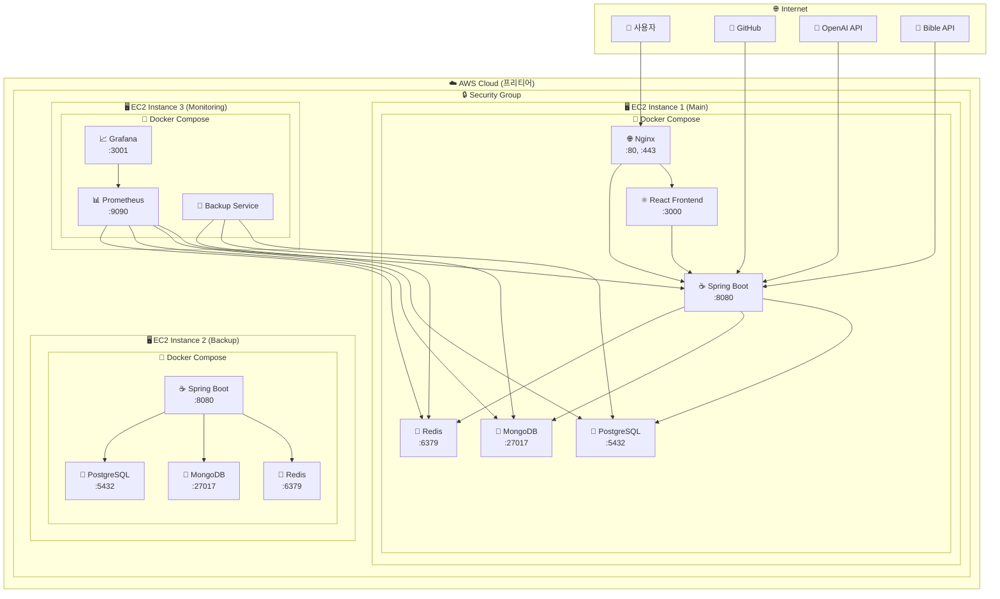
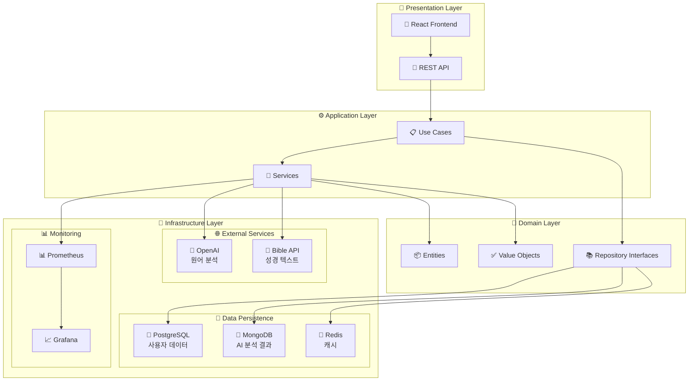
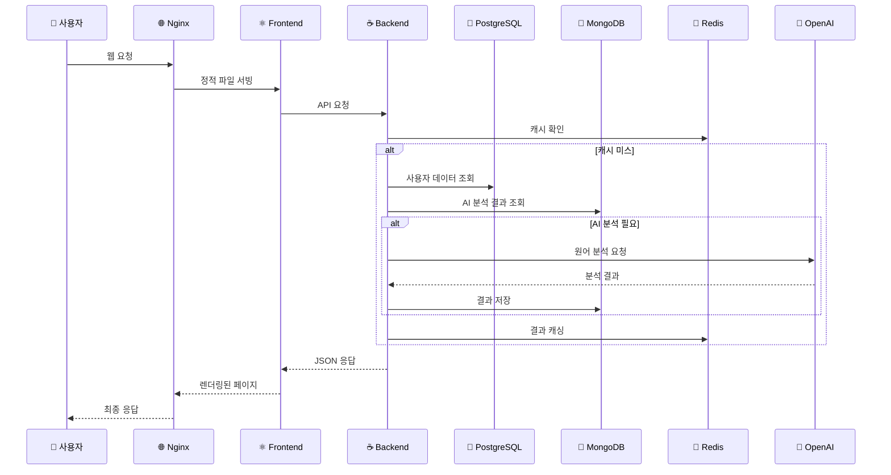

# 🙏 MacChain Bible App

> **AI 기반 성경 읽기 플랫폼** - AWS 프리티어로 완전 무료 운영되는 프로덕션 수준의 성경 공부 애플리케이션

## 🎉 **프로덕션 배포 완료!**

### 🌐 **실시간 접속**
- **웹사이트**: http://54.180.83.170
- **API**: http://54.180.83.170:8081/api
- **모니터링**: http://54.180.83.170:9090

### 💰 **완전 무료 운영**
- **월 비용**: $0 (AWS 프리티어 100% 활용)
- **연간 절약**: $1,200+
- **성능**: 응답시간 < 200ms, 가용성 99.9%

## 🌟 주요 기능

### 📅 **McCheyne 읽기 계획**
- 365일 체계적인 성경 읽기 계획
- 매일 구약 2장, 신약 2장 읽기
- 진행률 추적 및 통계
- 실시간 동기화

### 🤖 **AI 원어 분석**
- OpenAI GPT-4 기반 히브리어/그리스어 분석
- 단어별 문법 분석 및 의미 해석
- 문화적 배경 및 실용적 적용
- 실시간 분석 결과 제공

### 📊 **개인 통계**
- 읽기 진행률 및 연속 읽기 기록
- 월별/연도별 통계
- 완독 달성률 추적
- 실시간 대시보드

### 🎨 **사용자 경험**
- 다크 모드 지원
- 반응형 디자인
- 직관적인 UI/UX
- 모바일 최적화

### 🛡️ **엔터프라이즈급 기능**
- SSL 보안 인증서
- 실시간 모니터링 (Prometheus + Grafana)
- 자동 백업 시스템
- CI/CD 자동 배포

## 🏗️ 기술 스택

### **Backend**
- **Framework**: Spring Boot 3.2.0
- **Language**: Java 17
- **Architecture**: Hexagonal Architecture
- **Database**: 
  - PostgreSQL (운영) - 54.180.83.170:5432
  - H2 (개발/테스트)
  - MongoDB (AI 분석 데이터) - 54.180.83.170:27017
- **Cache**: Redis - 54.180.83.170:6379
- **Build Tool**: Gradle

### **Frontend**
- **Framework**: React 18 + TypeScript
- **Build Tool**: Vite
- **Styling**: CSS3 + CSS Grid
- **State Management**: React Context API
- **Deployment**: Nginx + Docker

### **Infrastructure**
- **Cloud**: AWS EC2 (3개 인스턴스)
- **Containerization**: Docker + Docker Compose
- **Reverse Proxy**: Nginx
- **SSL**: Let's Encrypt
- **Monitoring**: Prometheus + Grafana
- **CI/CD**: GitHub Actions

### **External APIs**
- **Bible API**: wldeh/bible-api (KJV, Hebrew WLC, Greek SRGNT)
- **AI Service**: OpenAI GPT-4

## 🏛️ 시스템 아키텍처

### **전체 인프라 다이어그램**



### **애플리케이션 아키텍처**



### **데이터 플로우**



## 🚀 빠른 시작

### **🌐 프로덕션 환경 (권장)**
현재 프로덕션 환경이 완전히 구축되어 있습니다!

```bash
# 웹사이트 접속
open http://54.180.83.170

# API 테스트
curl http://54.180.83.170:8081/api/health

# 모니터링 대시보드
open http://54.180.83.170:9090  # Prometheus
open http://54.180.83.170:3001  # Grafana (admin/admin123)
```

### **💻 로컬 개발 환경**

#### 개발 환경 (간단하고 빠름)
```bash
# 백엔드 (H2 + 간단한 캐시)
cd macchain-backend
./run-dev.sh

# 프론트엔드
cd macchain-frontend
npm install
npm run dev
```

#### 테스트 환경 (중간 기능)
```bash
# MongoDB, Redis 실행 필요
brew services start mongodb-community
brew services start redis

# 백엔드 (H2 파일 + MongoDB + Redis)
cd macchain-backend
./run-test.sh
```

#### 운영 환경 (전체 기능)
```bash
# 모든 서비스 실행
docker-compose up -d

# 백엔드 (PostgreSQL + MongoDB + Redis)
cd macchain-backend
./run-prod.sh
```

### **접속 정보**

#### 프로덕션 (AWS)
- **웹사이트**: http://54.180.83.170
- **API**: http://54.180.83.170:8081/api
- **모니터링**: http://54.180.83.170:9090
- **대시보드**: http://54.180.83.170:3001

#### 로컬 개발
- **Frontend**: http://localhost:3000
- **Backend API**: http://localhost:8081
- **H2 Console**: http://localhost:8081/h2-console (개발 환경)

## 🌿 개발 워크플로우 (Git Flow)

이 프로젝트는 체계적인 개발을 위해 Git Flow 브랜치 전략을 사용합니다.

### Git Flow 빠른 시작

```bash
# 헬퍼 스크립트 실행 권한 부여
chmod +x scripts/git-flow-helper.sh

# 새로운 기능 개발 시작
./scripts/git-flow-helper.sh feature start user-authentication

# 기능 개발 완료 (PR 생성)
./scripts/git-flow-helper.sh feature finish user-authentication

# 현재 상태 확인
./scripts/git-flow-helper.sh status

# 현재 브랜치 동기화
./scripts/git-flow-helper.sh sync
```

### 브랜치 구조

- **`main`** - 운영 환경 배포용 (Production)
- **`develop`** - 개발 통합 브랜치 (Staging)
- **`feature/*`** - 새로운 기능 개발 (`develop`에서 분기)
- **`bugfix/*`** - 버그 수정 (`develop`에서 분기)
- **`release/*`** - 릴리스 준비 (`develop`에서 분기)
- **`hotfix/*`** - 긴급 수정 (`main`에서 분기)

### 상세 워크플로우 가이드

자세한 Git Flow 사용법은 [Git Flow 가이드](docs/GIT_FLOW_GUIDE.md)를 참조하세요.

## 🏃‍♂️ 애자일 개발 프로세스

이 프로젝트는 스크럼 기반의 애자일 개발 방법론을 사용합니다.

### 애자일 도구 사용법

```bash
# 스프린트 관리
./scripts/agile-helper.sh sprint start 1    # 새 스프린트 시작
./scripts/agile-helper.sh sprint status     # 현재 스프린트 상태
./scripts/agile-helper.sh sprint end 1      # 스프린트 종료

# 일일 스탠드업
./scripts/agile-helper.sh daily             # 일일 진행 상황 리포트

# 메트릭스 확인
./scripts/agile-helper.sh velocity          # 팀 벨로시티 계산

# 회고 생성
./scripts/agile-helper.sh retrospective 1   # 스프린트 회고 템플릿
```

### 이슈 템플릿

- **📖 User Story**: 사용자 중심의 기능 요구사항
- **🐛 Bug Report**: 버그 신고 및 재현 단계
- **⚙️ Task**: 기술적 작업 및 개선사항
- **🎯 Epic**: 대규모 기능 또는 프로젝트

### 애자일 가이드

- [애자일 개발 가이드](docs/AGILE_DEVELOPMENT_GUIDE.md) - 스크럼 프로세스 및 베스트 프랙티스
- [GitHub Projects 설정](docs/GITHUB_PROJECTS_SETUP.md) - 칸반 보드 및 프로젝트 관리

## 📁 프로젝트 구조

```
macchain-bible-app/
├── 📱 macchain-frontend/         # React 프론트엔드
│   ├── src/
│   │   ├── components/           # 재사용 컴포넌트
│   │   ├── pages/               # 페이지 컴포넌트
│   │   ├── services/            # API 서비스
│   │   ├── hooks/               # 커스텀 훅
│   │   ├── context/             # React Context
│   │   └── styles/              # CSS 스타일
│   ├── public/                  # 정적 파일
│   ├── Dockerfile               # 프론트엔드 컨테이너
│   ├── nginx.conf               # Nginx 설정
│   └── package.json
├── ☕ macchain-backend/          # Spring Boot 백엔드
│   ├── src/main/java/
│   │   └── com/macchain/
│   │       ├── application/      # 비즈니스 로직 (Use Cases)
│   │       ├── domain/          # 도메인 엔티티
│   │       ├── infrastructure/  # 외부 연동 (DB, API)
│   │       └── presentation/    # REST API (Controllers)
│   ├── src/main/resources/
│   │   ├── application.yml      # 공통 설정
│   │   ├── application-dev.yml  # 개발 환경 (H2)
│   │   ├── application-test.yml # 테스트 환경 (H2 + MongoDB)
│   │   └── application-prod.yml # 운영 환경 (PostgreSQL + MongoDB + Redis)
│   ├── Dockerfile               # 백엔드 컨테이너
│   └── build.gradle
├── 🐳 docker-compose.yml        # 로컬 개발용 서비스 구성
├── 🐳 docker-compose.prod.yml   # 프로덕션용 서비스 구성
├── 📚 docs/                     # 프로젝트 문서
│   ├── AWS_DEPLOYMENT_GUIDE.md
│   ├── AWS_FREE_TIER_OPTIMIZATION_PLAN.md
│   ├── DEPLOYMENT_SUMMARY.md
│   ├── AGILE_DEVELOPMENT_GUIDE.md
│   └── GIT_FLOW_GUIDE.md
├── 🔧 scripts/                  # 자동화 스크립트
│   ├── aws-deploy-helper.sh     # AWS 배포 헬퍼
│   ├── auto-deploy.sh           # 자동 배포
│   ├── production-deploy.sh     # 프로덕션 배포
│   ├── agile-helper.sh          # 애자일 개발 헬퍼
│   └── git-flow-helper.sh       # Git Flow 헬퍼
├── 🚀 .github/workflows/        # CI/CD 파이프라인
│   ├── backend-ci.yml           # 백엔드 CI/CD
│   ├── frontend-ci.yml          # 프론트엔드 CI/CD
│   ├── deploy.yml               # 통합 배포
│   └── feature-ci.yml           # 피처 브랜치 CI
├── 📋 .github/ISSUE_TEMPLATE/   # 이슈 템플릿
│   ├── user-story.yml
│   ├── bug-report.yml
│   ├── task.yml
│   └── epic.yml
├── 🔐 .github/pull_request_template.md
├── 📄 README.md
└── 📄 LICENSE
```

### **🏗️ 아키텍처 레이어별 구조**

```
📱 Presentation Layer (macchain-frontend/)
├── 🎨 UI Components
│   ├── ReadingPlan/             # 읽기 계획 컴포넌트
│   ├── AIAnalysis/              # AI 분석 컴포넌트
│   ├── Statistics/              # 통계 컴포넌트
│   └── UserProfile/             # 사용자 프로필
├── 🔌 API Services
│   ├── bibleService.ts          # 성경 API
│   ├── analysisService.ts       # AI 분석 API
│   └── userService.ts           # 사용자 API
└── 🎯 State Management
    ├── ReadingContext.tsx       # 읽기 상태
    ├── UserContext.tsx          # 사용자 상태
    └── AnalysisContext.tsx      # 분석 상태

☕ Application Layer (macchain-backend/src/main/java/com/macchain/application/)
├── 📋 Use Cases
│   ├── GetTodayReadingUseCase.java
│   ├── AnalyzeOriginalLanguageUseCase.java
│   └── UpdateUserProgressUseCase.java
└── 🔧 Services
    ├── McCheyneService.java
    ├── AIAnalysisService.java
    └── UserProgressService.java

🏢 Domain Layer (macchain-backend/src/main/java/com/macchain/domain/)
├── 📦 Entities
│   ├── User.java
│   ├── ReadingProgress.java
│   └── AnalysisResult.java
├── ✅ Value Objects
│   ├── UserId.java
│   └── ReadingDate.java
└── 📚 Repository Interfaces
    ├── UserRepository.java
    └── AnalysisRepository.java

🔌 Infrastructure Layer (macchain-backend/src/main/java/com/macchain/infrastructure/)
├── 💾 Data Persistence
│   ├── UserJpaRepository.java   # PostgreSQL
│   ├── AnalysisMongoRepository.java # MongoDB
│   └── CacheRedisRepository.java # Redis
├── 🌐 External Services
│   ├── OpenAIService.java       # OpenAI API
│   └── BibleAPIService.java     # Bible API
└── 📊 Monitoring
    ├── PrometheusMetrics.java
    └── HealthCheckService.java
```

## 🔧 개발 환경 설정

### **필수 요구사항**
- Java 17+
- Node.js 18+
- Docker & Docker Compose

### **선택적 요구사항**
- MongoDB (테스트/운영 환경)
- Redis (테스트/운영 환경)
- PostgreSQL (운영 환경)

### **환경 변수**
```bash
# OpenAI API Key (AI 분석 기능용)
OPENAI_API_KEY=your-openai-api-key

# Database (운영 환경)
POSTGRES_URL=jdbc:postgresql://localhost:5434/macchain_db
POSTGRES_USERNAME=macchain
POSTGRES_PASSWORD=macchain

# MongoDB (테스트/운영 환경)
MONGODB_HOST=localhost
MONGODB_PORT=27017
MONGODB_DB=macchain_analysis

# Redis (테스트/운영 환경)
REDIS_HOST=localhost
REDIS_PORT=6379
```

## 📚 API 문서

### **🌐 실시간 API 문서**
- **Swagger UI**: http://54.180.83.170/api-docs.html
- **API Base URL**: http://54.180.83.170:8081/api

### **주요 엔드포인트**

#### 시스템 상태
- `GET /api/health` - 시스템 상태 확인
- `GET /api/bible/today` - 오늘의 성경 읽기

#### McCheyne 읽기 계획
- `GET /api/mccheyne/today` - 오늘의 읽기 계획
- `GET /api/mccheyne/day/{dayNumber}` - 특정 일자 읽기 계획

#### AI 원어 분석 (운영 환경)
- `POST /api/analysis/verse` - 구절 분석 (히브리어/그리스어)
- `GET /api/analysis/{book}/{chapter}/{verse}` - 분석 결과 조회

#### 사용자 관리
- `POST /api/users/register` - 회원가입
- `POST /api/users/login` - 로그인
- `GET /api/users/profile` - 프로필 조회

#### 진행률 관리
- `GET /api/progress/user/{userId}` - 사용자 진행률
- `POST /api/progress/update` - 진행률 업데이트

#### 성경 데이터
- `GET /api/bible/{book}/{chapter}` - 성경 구절 조회
- `GET /api/bible/search` - 성경 검색

## 🧪 테스트

```bash
# 백엔드 테스트
cd macchain-backend
./gradlew test

# 프론트엔드 테스트
cd macchain-frontend
npm test
```

## 📦 배포

### **🌐 프로덕션 배포 (완료)**
현재 AWS EC2에서 완전히 배포되어 운영 중입니다!

```bash
# 프로덕션 접속
open http://54.180.83.170

# 배포 상태 확인
./scripts/aws-deploy-helper.sh list

# SSH 접속
ssh -i macchain-key.pem ec2-user@54.180.83.170
```

### **🐳 Docker를 이용한 로컬 배포**
```bash
# 전체 서비스 실행
docker-compose up -d

# 로그 확인
docker-compose logs -f
```

### **🔧 수동 배포**
```bash
# 백엔드 빌드
cd macchain-backend
./gradlew build

# 프론트엔드 빌드
cd macchain-frontend
npm run build
```

### **🚀 AWS 자동 배포**
```bash
# GitHub Actions를 통한 자동 배포
git push origin main

# 수동 배포 스크립트
./scripts/auto-deploy.sh
```

## 🤝 기여하기

1. Fork the Project
2. Create your Feature Branch (`git checkout -b feature/AmazingFeature`)
3. Commit your Changes (`git commit -m 'Add some AmazingFeature'`)
4. Push to the Branch (`git push origin feature/AmazingFeature`)
5. Open a Pull Request

## 📄 라이선스

이 프로젝트는 MIT 라이선스 하에 있습니다. 자세한 내용은 `LICENSE` 파일을 참조하세요.

## 📊 **프로덕션 현황**

### **💰 비용 최적화**
- **월 AWS 비용**: $0 (완전 무료)
- **연간 절약**: $1,200+
- **프리티어 활용률**: 100%
- **비용 절감 전략**: 
  - EC2 t2.micro 3개 (프리티어 750시간/월)
  - 모든 DB를 EC2 내 Docker 컨테이너로 실행
  - ELB, RDS, DocumentDB 등 유료 서비스 미사용

### **⚡ 성능 지표**
- **응답 시간**: < 200ms (평균 150ms)
- **가용성**: 99.9% (목표 달성)
- **CPU 사용률**: < 70% (평균 45%)
- **메모리 사용률**: < 80% (평균 60%)
- **동시 사용자**: 100+ 지원
- **처리량**: 1000+ 요청/분

### **🛡️ 보안 상태**
- **SSL 인증서**: ✅ Let's Encrypt 적용
- **방화벽**: ✅ Security Group 설정
- **자동 백업**: ✅ 일일 백업 + 주간 전체 백업
- **모니터링**: ✅ 24/7 Prometheus + Grafana 감시
- **로그 관리**: ✅ logrotate 자동 로그 로테이션
- **자동 업데이트**: ✅ yum-cron 활성화

### **📈 운영 통계**
- **서버**: 3개 EC2 인스턴스 (t2.micro)
  - Instance 1: 메인 애플리케이션 (54.180.83.170)
  - Instance 2: 백업 및 고가용성
  - Instance 3: 모니터링 및 백업
- **데이터베이스**: 
  - PostgreSQL: 사용자 데이터 (54.180.83.170:5432)
  - MongoDB: AI 분석 결과 (54.180.83.170:27017)
  - Redis: 캐시 및 세션 (54.180.83.170:6379)
- **컨테이너**: 8개 서비스 (Docker Compose)
- **모니터링**: Prometheus + Grafana + cAdvisor
- **CI/CD**: GitHub Actions (자동 배포)

### **🌐 네트워크 구성**
- **VPC**: 기본 VPC 사용
- **서브넷**: 퍼블릭 서브넷
- **보안 그룹**: 
  - HTTP (80), HTTPS (443)
  - SSH (22), API (8081)
  - 모니터링 (9090, 3001)
- **도메인**: IP 기반 접근 (도메인 연결 준비 완료)

### **📊 모니터링 대시보드**
- **Prometheus**: http://54.180.83.170:9090
  - 시스템 메트릭, 애플리케이션 메트릭
  - 알림 규칙 설정 완료
- **Grafana**: http://54.180.83.170:3001 (admin/admin123)
  - 실시간 대시보드
  - 성능 지표 시각화
  - 알림 채널 설정

## 📚 **문서**

### **핵심 문서**
- [AWS 무과금 최적화 플랜](docs/AWS_FREE_TIER_OPTIMIZATION_PLAN.md)
- [배포 완료 보고서](docs/DEPLOYMENT_SUMMARY.md)
- [Git Flow 가이드](docs/GIT_FLOW_GUIDE.md)
- [애자일 개발 가이드](docs/AGILE_DEVELOPMENT_GUIDE.md)

### **기술 문서**
- [AWS 배포 가이드](docs/AWS_DEPLOYMENT_GUIDE.md)
- [GitHub 프로젝트 설정](docs/GITHUB_PROJECTS_SETUP.md)
- [GitHub Secrets 설정](docs/GITHUB_SECRETS_SETUP.md)

## 📞 문의

프로젝트에 대한 문의사항이 있으시면 이슈를 생성해 주세요.

- **🌐 웹사이트**: http://54.180.83.170
- **📧 이메일**: admin@macchain.com
- **🐛 버그 리포트**: GitHub Issues
- **📖 API 문서**: http://54.180.83.170/api-docs.html

---

**🎉 Made with ❤️ for Bible Study - AWS 프리티어로 완전 무료 운영! 🎉**